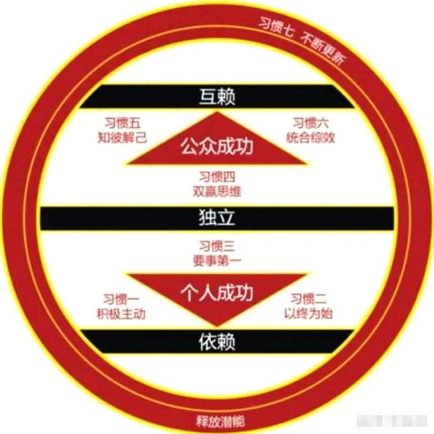
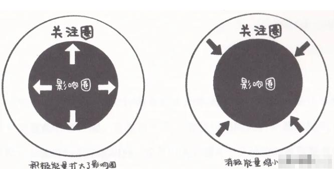
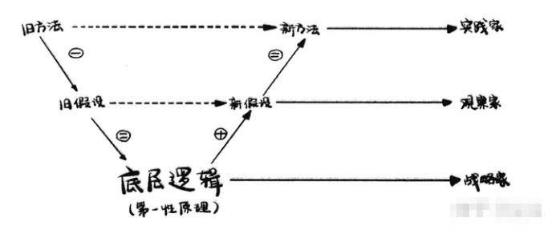

>   知己知彼就是“比被别人理解更重要的是理解别人”

【内容简介】
------

*   本书作者刘润整理出了一幅个人能力发展地图，基本都是职场必备技能，主要包括几个大部分：一是用两章篇幅精选了《高效能人士的七个习惯》一书中的七个习惯，这本书也推荐大家读一读，受益匪浅。二是给出了学习、职场与生活中都非常重要的能力：如学习能力、时间管理能力、逻辑能力、演讲能力、沟通能力等等。可以做为一本工具书，如果对某一个章节感兴趣，或者觉得对自己的生活有帮助，那么我们可以按图索骏，根据书中提到的思维模型或者原理，去进一步的深入研究。

* * *

【书中传递】
------

*   个人感觉，觉得学习能力对自己帮助比较大，由于工作原因，自己需要快速去了解一个行业，但有时又无需要按照刻意练习的方式去学习1万小时。这时书中提到的快速学习的方法就非常有效。详见学会能力一篇。
*   在书中教了我们十种能力，这十种能力，我觉得最最重要的就是脱离事物看本质，分析事物的发展规律的能力，当然，这个能力不是轻易可以得来的，但是有很多的套路与思维模型可以帮助我们去训练。
*   这是一本相见恨晚的书，书里都是“套路”；是一个一个帮我们解决生活、工作中问题的套路，学习了这些套路，可以提升我们的效率，做到真正的事半功倍。“花半秒钟看透事物本质的人，比那些花一辈子都看不清的人，拥有截然不同的命运”。
*   刘润老师一直在强调洞察力，通过看了这本书，我真切的感觉到自己看书之前生活的效率是非常低的。但也是幸亏看了这本书，我感觉今后的人生肯定会更加高效。
*   要好好学习利用书中的套路，去提长自己想要提升的能力，比如写作、演讲、影响力、更加高效的工作与生活。做事情要学习思考三个问题，WHAT（是什么），WHY（为什么），How（怎么做）。
*   七类提问抽屉，是真的非常好用，可以有效的帮助自己思考。

* * *

【精彩摘抄】
------

第一章 高效能人士的习惯
------------

1.  你可能连杯子都要换掉——思维转换

1.  如果只想发生较小的变化，专注于自己的态度与行为即可；但如果想发生实质性变化，就需要进行“思维转换”，改变理解世界的方式。

3.  独立是不成熟的表现——成熟模式图

1.  积极主动、以终为始、要事第一，帮我们实现个人成功；双赢思维、知彼解己、统合综效，能实现公众成功；不断更新，则可以让自己变得越来越成熟。

  

  

以下三个习惯为“**个人成功**”阶段

1.  积极主动，就是从“我不得不做”变成“我想做”；
2.  以始为终，就是先在“脑海中构建未来”，才可能在现实中实现未来；
3.  要事第一，就是”多做重要的事情，就会减少紧急的事情“

以下三个习惯**“公众成功”**阶段

1.  双赢思维就是“只有我成功不够，你也要成功”
2.  知己知彼就是“比被别人理解更重要的是理解别人”
3.  统合综效就是“你相不相信可以和竞争对手共赢”
4.  **第七个习惯是“不断更新**”。习惯的形成不是一蹴而就的，需要不断练习，才能更加成熟。

> 成熟模式图从依赖期到独立期，最终达到互赖期的两个阶段与七个习惯。积极主动、以始为终、要事第一，这三个习惯，帮我们达到“个人成功”阶段；双赢思维、知彼知已、统合综效，这三个习惯帮我们达到“公众成功”阶段。“不断更新”习惯能帮我们不断磨砺前六个习惯，让自己变得越来越成熟。

1.  积成主动——别让消极把你拉入海底。

> 不把责任推给基因、命运、环境等因素，用“选择的自由”对自己负全责。这是从依赖期走向独立期最重要的习惯。  
>   
> 怎样才能不受外部环境或他人干扰，积极获得主动权？  
> 第一，在刺激和回应之间，给自己思考的时间。  
> 第二，用积极的语言替代消极的语言。  
> 第三，减小关注圈，扩大影响圈。

  

  

1.  以始为终——别把成功的梯子搭错了墙

以终为始，是从依赖期到独立期需要养成的第二个习惯，把基于心智的第一次创造的“终”，作为基于实际的第二次创造的“始”。怎么才能以终为始？要注意三件事：确定目标、坚持原则和做好计划。

1.  要事第一——我不忙，我只是时间不够

在时间管理矩阵中，第一象限是“重要且紧急”的事情；第二象限是“重要但不紧急”的事情；第三象限是“紧急但不重要”的事情；第四象限是“不重要也不紧急”的事情。针对不同象限的事情，应该使用不同的策略：主动干掉一切“不重要也不紧急”的事情，拒绝大部分“紧急但不重要”的事情，专注于“重要但不紧急”的事情。

1.  双赢思维——双你我都要赢，否则就别干

合作一定要让双方都获得价值。如果一方赚钱是建立在另一方损失的基础之上，这样的买卖不做也罢。修炼双赢思维有三个境界：第一，鸡的境界是“我要赢，更重要的是你要输”；第二，雀的境界是“我要赢，如果因此你输了，别怪我”；第三，鹰的境界是“你我都要赢，否则就别干”。

1.  知彼知己——先理解别人，再被别人理解

先理解别人，再寻求被别人理解。理解别人，是重要的态度；聆听别人，是重要的技能。怎么做呢？第一、戒掉“自传式”回应；第二、用耳朵听，用眼睛看，用心理解；第三，移情聆听。

1.  统合综效——太棒了，居然还可以这样

通过创造性合作，实现整体大于部分之和。秉持双赢思维，运用知彼解己的习惯，才能产生统合综效的成果。怎么训练统合综效呢？第一，尊重差异，感激多样性；第二，培养自己从报仇，到妥协，到合作；第三，发现共享目标，通过创造性合作，找到第三方案。

1.  不断更新——把优秀变成一种习惯

习惯需要不断训练，持续积累。不断更新，就是通过身体、精神、智力、社会/情感四个方面的不断训练，磨砺其他六个习惯（积极主动、以终为始、要事第一、双赢思维、知彼解己、统合综效），从而把优秀变成一种习惯。

1.  习惯——.从狭窄的5%跨到广阔的95%

一些人做起来别扭的事情，另一些人却觉得很自然，这就是习惯。在人的行为中，只有5%是由思考脑中的逻辑驱动的，还有95%是由反射脑中的习惯驱动的。养成好习惯，不但可以“做自己”，而且可以成为“更好的自己”。从本质上讲，就是把思考脑中的逻辑，通过反复训练，变成反射脑中的习惯，然后用习惯指导一生。

第二章 高效能人士的素养
------------

1.  微信礼仪

让跟你打交道的人感觉舒服，这就叫职业化。

1.  时间颗粒度——反映职业化程度

时间颗粒度是一个人管理时间的基本单位。有人的时间颗粒度是半天，比如退休老人；有人的时间颗粒度是15分钟，比如王健林；有人的时间颗粒度是5分钟，比如比尔·盖茨。在商业世界中，拥有受人尊敬的职业化素养，恪守时间，是一项基本要求。而恪守时间的本质，就是理解并尊重别人的时间颗粒度。

1.  事实与观点——事实有真假，观点无对错

事实，就是在客观世界中，可以被证实或者证伪的东西；观点，就是在一套认知体系中，不违反事实，逻辑自洽，因此无法被证明对错的东西。事实有真假，观点无对错。遇到不同观点时，不要争得面红耳赤、割席断交，而要说“有趣”。

1.  职业化

职业化的本质，是通过尊重别人，从而赢得尊重，降低信任成本。职业化是商业世界的教养，来自对外的分寸感和对内的克制力。而非职业化的表现包括失信、迟到、劝酒和打扰。

第三章 时间管理
--------

1.  时间成本

时间成本，就是如果把这个时间用于做别的事情时，可以获得的收益。懂得计算时间成本，可以帮助我们做出理性决策，比如一件事情到底是自己做合算，还是花钱请别人做合算。

1.  让大脑来思考而不是记事——GTD

这是一套“把大脑用来思考，而不是记事”的时间管理方法，通过借助外部工具，比如印象笔记，第一步清空大脑，把所有事情放入收集篮；第二步处理收集篮，把事情按照删除、归档、将来/可能、等待、下一步行动、项目的方法归类；第三步随时回顾、每天回顾、每周回顾，从分类中提取需要完成的事情，然后行动。GTD可以消除焦虑，让我们专注于思考和解决问题。

1.  猴子理论——别让猴子跳到背上

猴子理论，就是让责任待在它的主人身上，不要让别人的猴子爬满你全身，结果自己焦头烂额，别人也无法成长。正确的做法是，老板用“你觉得呢”来提问，帮助下属养成“只出选择题，不出问答题”的习惯。这样既节省老板的时间，也培养下属的能力。

1.  三八理论——人生的不同由第三个8小时创造

上天公平地给了每个人每天24小时。第一个8小时，大家都在工作；第二个8小时，大家都在睡觉；而人与人的区别，其实主要是由第三个8小时造成的。怎样才能善用第三个8小时，创造不一样的人生呢？第一，找到“不被打扰的时间”；第二，分清“交易、消费和投资”；第三，持之以恒，日拱一卒。

1.  番茄工作法——人真的可以三头六臂吗

番茄工作法，就是每集中精力工作25分钟，休息5分钟。这是一种用合适的时间颗粒度，来保证注意力专注度的工作方法。在执行时需要注意：第一，防止被打断；第二，努力进入心流体验；第三，要专注，也要休息。

第四章 学习能力（精）
-----------

1.  幸存者偏见

所有的成功者其实都是幸存者。幸存者偏见是一种常见的逻辑谬误，我们只能看到经过某种筛选产生的结果，并没有意识到筛选的过程可能忽略了一些非常关键的信息。避免幸存者偏见，要做到：第一，向失败者学习；第二，向反对者学习；第三，培养识别幸存者偏见的能力。

1.  库伯学习圈——知识是经验的升华

一个完整的学习是“行动一经验一规律一行动”的四步大循环，一步都不能少，否则就会犯经验主义或者行动派的错误。具体怎么做呢？从行动归纳出经验，把经验升华为规律，再用规律指导行动。尤其是“把经验升华为规律”这一步，是学习的核心。

1.  知识、技能和态度——为什么人类不擅长谈恋爱

学习只有三件事：用脑学习知识，用手学习技能，用心学习态度。

知识就是已经被发现和证明的规律，它是确定的。技能就是那些你以为你知道，但如果没亲自做过，就永远不会真正知道的事情。态度就是你选择的，用来看待这个世界的那副“有色眼镜”。保持终生学习，要注意几点：第一，不要把知识当技能学；第二，不要把技能当知识学。

1.  私人董事会——做自己人生的CEO，你有私人董事会吗？

一个标准的私人董事会一般由16~18名董事组成。第一，为了能放心学习，他们必须来自非竞争行业，并签署保密协议；第二，为了能互相学习，他们的经营规模和发展阶段必须比较接近；第三，为了能学以致用，他们必须是一把手，比如董事长或CEO。从这三大规则就能看出，私人董事会专为彼此学习做了设定。

**私人董事会最大的魅力来自于8大步骤：提案、表决、阐述、提问、澄清、分享和建议、总结、反馈。**

第一，提案。

每个企业家都要提交一个议题（真实的问题）。

第二，表决。

由全体董事投票表决：我们今天到底帮谁解决问题。

第三，阐述。

被选中的“问题拥有者”，向董事们详细阐述自己的问题。

第四，提问。

董事们可以向“问题拥有者”提问。

第五，澄清

一轮提问下来，“问题拥有者”可能会发现，自己关注的问题地焦点不对，并重新澄清问题。

第六，分享和建议。

这时，董事们可以分享经验、提建议了。一般来说，每人3分钟，以练习精确表达。

第七，总结

问题拥有者总结问题的改进步骤和时间，最后所有董事分享今天内容对自己的启发。

第八，反馈

问题拥有者在下次私人董事会上，向所有董事汇报他实施的进展，并征求下一步的建议。

*   这是一套建立学习小组，向他人学习的方法，有三大规则和八大步骤。三大规则分别是：不竞争、同规模和一把手。八大步骤分别是：提案、表决、阐述、提问、澄清、分享和建议、总结、反馈。

1.  **快速学习——如何利用20小时快速学习（精）**

想要快速学会行业80%的核心逻辑，你需要先花时间大量泛读，形成系统模型，之后求助专家，把你的理解复述给别人听，检查薄弱点。

**快速学习四步法：**

**第一步：大量泛读**

比如，要学习“区块链”的相关知识，可以先登录豆瓣网，搜索“区块链”及相关关键字，找到评价最高的3本书；接着，通过“喜欢xx书的人也喜欢”，再选5本；最后，加选2本可能不太畅销，但系统性明显更强的书，如《区块链原理》等。把这10本书都买回来，开始泛读。泛读时注意几点：

一、5分钟看自序，5分钟看目录。

很多人不看自序和目录，这又是一个坏习惯，因为作者会在自序中梳理框架逻辑，在目录中提炼核心观点。

二、15分钟泛读。要点是：略过故事、案例和证明；标注概念、模型、公式和核心观点。

三、最后用5分钟做简单回顾，记录下自己的困惑、问题和想法。

可以专门选择一个时间长一点的下午，或者再加上晚上的时间，高强度地把这10本书读完。建议读电子版，可以大大提高标注、回顾、记录的效率。

**第二步，建立模型。**

好好睡一觉，让知识在大脑中自由地碰撞、连接、融合。第二天早上，用头脑最清醒的3小时来建立模型。

应该怎么做？

找一面巨大的白板墙，先把标注的概念、模型和公式写在即时贴上，贴到白板上，再用白板笔和板擦，建立、修正它们之间的关联，逐渐形成系统模型。

**第三步，求教专家**

如果还有不清楚的问题，就要求教真正的专家。比如，我在研究虚拟现实的时候，找了一个专门投资虚拟现实的基金公司，登门拜访。他们一年之内，看了200多个虚拟现实的创业项目。我向基金创始人求教了两个小时，很多问题豁然开朗。

为什么要先建立模型，而不是先求教专家呢？因为如果没有基本的全局观，就问不出好问题。另外，有些专家有着犀利的洞察，但未必有全局观。要是让他自由发挥地讲上两小时，你很可能会不知所云。

如果不知道去哪里找业内专家，可以上类似“在行”之类的平台，花些费用，带着问题虚心求教，然后修正自己的模型。

**第四步，理解复述。**

假如花了5小时泛读、3小时建模、2小时求教，剩下的10小时就可以花在“复述”上了。

关于学习，有个著名的“费曼技巧”，就是用你的语言，把你的模型讲给别人听。这么做，你很可能会发现，自己讲着讲着就讲不明白了。或者，你觉得自己讲明白了，但别人就是听不懂。这些地方，就是你理解的薄弱点。

记下这些薄弱点，回到泛读资料里，重新理解。或者上互联网找答案、再请教专家等。重新理解后，再复述，如此重复。最终，你就会用20小时，快速地学习一项完全陌生的知识。我们常听说“10000小时定律”，这是帮助人们从“学会”到“精通”的刻意练习方法。而从“不会”到“学会”，也许20小时就可以了。

> **总结：**  
> 只要方法得当，快速学习一项完全陌生的知识，只要20小时就可以了。快速学习四步法包括：第一步，大量泛读。泛读时可以5分钟看自序，5分钟看目录；15分钟泛读；最后用5分钟简单回顾。第二步，建立模型。先把标注的概念、模型和公式写在即时贴上，贴到白板上，再用白板笔和板擦，建立、修正它们之间的关联，逐渐形成系统模型。第三步，求教专家。第四步，理解复述。用你的语言，把你的模型讲给别人听。

第五章 思考能力
--------

1.  六顶思考帽——从对抗思考到平行思考

思考方法是极其重要的基本技能。如果思考能力不够，其他任何能力都要打折。

六顶思考帽：

代表“信息”的白帽，充分搜集数据、信息和所有需要了解的情况；

代表“价值”的黄帽，集中发现价值、好处和利益；

代表“感觉”的红帽，让团队成员释放情绪和互相了解感受；

代表“创造”的绿帽，专注于想点子，寻找解决办法；

代表“困难”的黑帽，只专注缺陷，找到问题所在；

代表“管理思维过程”的蓝帽，安排思考顺序，分配思考时间。

小结：

每个人都有六顶不同颜色、代表不同思维方式的“帽子”。同一时刻只戴一顶思考帽，从争论式的“对抗性思维”，走向集思广益式的“平行思维”，从而克服人脑容易情绪化、不知所措和混乱的缺陷。六顶思考帽的戴法顺序无穷无尽，有几个基本建议：白帽先行（获取信息）、黄在黑前（先思考价值再思考困难）、黑后有绿（看到所有问题后，再努力寻找解决办法）。

1.  批判性思维——大胆质疑，谨慎断言

批判性思维，指的是熟练地和公正地评价证据的质量，检测错误、虚假、篡改、伪装和偏见的能力。它能帮我们尽可能地获得最准确的认知，接近真相。具体怎么做？第一，发现和质疑基础假设；第二，检查事实的准确性和逻辑一致性；第三，关注特殊背景和具体情况；第四，寻找其他可能性。

1.  全局之眼——冻死在那个不存在的冬天

世界上所有的东西都被规律作用着，以一种叫作“系统”的方式存在。要素，是系统中看得见的东西；关系，是系统中看不见的、要素之间相互作用的规律。看到要素，还要看到要素之间的关系，更要看到这些关系背后的规律，这就是“全局之眼”。学习用关联的、整体的、动态的方法，培养全局性看问题的能力。当一个人拥有了关联地（二维）、整体地（三维）、动态地（四维）看待事物的能力，他就真正拥有了全局之眼，可以站在未来看今天。

1.  逆向思维——电吹风的反而是吸尘器

从事物的反面去思考问题，能使问题获得创造性的解决。在商业界，尤其需要逆向思维的能力和训练。有**六种常用的逆向思维方法：结构逆向、功能逆向、状态逆向、原理逆向、序位逆向和方法逆向。**

1.  正向思维——做一个因果逻辑的收集者

正向思维，就是从因到果的思维，从已知预测未知的能力。它是基于在大脑中收集、整理、存放的大量的因果逻辑，而具有的一种推理能力。正向思维往过去用，可以用来归因；往未来用，可以用来预测。要训练这种能力：第一，做一个“因果逻辑收集者”；第二，多读侦探小说，多读科幻小说。

第六章 逻辑能力
--------

1.  同一律——白马到底是不是马

同一律是逻辑三大基本定律之一。它要求人们自觉地保持同一思维过程中概念、判断（或论题）的确定性。也就是说，它要求人们的思维具有确定性。混淆概念、偷换概念，混淆论题、偷换论题，会导致自己的思维一团糊糊，导致大家的讨论变成“鸡同鸭讲”。

1.  矛盾律——谁给理发师理发

矛盾律也是逻辑三大基本定律之一，指的是两个互相否定的思想，不可能都对，一定有一个是假的。关于“否定”，成功的否定，不是失败，而是“未成功”；开心的否定，不是伤心，不是不开心，而是“没有开心”。遵守矛盾律，要训练识别自相矛盾的概念、自相矛盾的判断和悖论。

排中律——生存还是毁灭，没有中间状态

排中律，就是两个自相矛盾的观点，一定有一个是对的，没有“都不对”这种中间状态。排中律可以用于识别和揭穿那些“模棱两不可”的骑墙者，提高思辨的能力，以及沟通的效率。但其最大的价值在于反证法。用“反设、归谬、存真”的方法，在两个自相矛盾的观点中，通过证明一个观点是错的，来证明另一个观点是对的。

1.  三段论——一眼识别诡辩的5个方法

想要成为商业世界的洞察者，就要多花时间，刻意训练严谨的推理能力和迅速识别逻辑谬误的能力。

简单来说，这是一种“大前提，小前提，结论”式的推理。想要“一眼识别诡辩”，需要掌握三段论的五项基本原则：四项错误；中项两不周延；大项扩大，小项扩大；前提都为否，结论不必然；前提有一否，结论必为否。

1.  归纳法——几乎所有的知识，都始于归纳法

归纳法是一种从特殊推出一般的方法。归纳法从现象提炼出猜想，演绎法把猜想证明为定律。几乎所有的知识，都始于归纳法。怎样训练归纳法？用著名的“穆勒五法”：第一，求同法；第二，求异法；第三，并用法；第四，共变法；第五，剩余法。

第七章 谈判能力
--------

1.  定位调整偏见——自己先开价还是对方先开价

把谈判战场直接定位到对方的底线，然后在此定位附近小范围拉锯，这能在信息不对称、利益不一致的谈判中，为自己争取最大利益。

定位调整偏见是一种谈判技巧，利用先入为主的定位效应，把价格谈判或者条件谈判直接锚定在对方的底线附近，然后拉锯。在信息不对称、利益不一致的谈判中，定位调整偏见可以为自己争取最大利益。具体有三个原则：第一，争取先开价；第二，越极端越好；第三，留还价余地。

1.  权力有限策略——这个要求，我要请示一下。

通过设定一个“不露面的人”，限制自己谈判的权力，给予自己在关键问题上说“不”的能力，让对方做出最大可能的让步。

通过设定一个真实或虚构的“不露面的人”，限制自己谈判的权力，从而给予自己在关键问题上，外表柔软、内心坚定地说“不”的能力，让对方大伤脑筋，做出最大可能的让步。运用权力有限策略有四种方法：第一，金额的限制；第二，条件的限制；第三，程序的限制；第四，法律的限制。

1.  谈判期限策略——女生为什么会逼婚

要充分利用时间对双方的不对等价值，获得谈判优势。若延长谈判时间对自己有利，就用战略延迟；对对方有利，就设定最后期限。

每一个阶段性的谈判成果，都要承认，绝不能没有理由地推倒重来，否则立刻失去谈下去的基础。

谈判期限策略，就是充分利用时间对双方的不对等价值，获得谈判优势。如果延长谈判时间对自己有利，就用“战略延迟”法；如果延长谈判时间对对方有利，就用“最后期限”法，倒转优劣势。

1.  出其不意策略——吃惊、撤退和转身就走

商业谈判中，试试用一些出其不意的策略，打破对方的谈判逻辑，击穿对方的心理防线，可以令其立刻处于巨大的谈判劣势中。

在商业谈判中，出其不意地打破对方的谈判逻辑，击穿对方的心理防线，令其立刻处于巨大的谈判劣势中。具体的做法有三种：吃惊、撤退和转身就走。

1.  双赢谈判——我多拿一元，你就必须少拿一元吗

并不是所有的谈判都是“我多拿一元，你就必须少拿一元”的零和谈判。还有在不损害他人的前提下，改善自己或者彼此共同利益的双赢谈判。这样的谈判结果，又称“帕累托最优”，即让双方的整体福利最大化。具体的做法有：第一，做大增量；第二，互补存量。

第八章 演讲能力（精）
-----------

1.  认知台阶——你不是在讲，而是在帮助他听

你永远不需要“把想法塞进别人的脑海中去”，你需要他们自取。要根据听众的听讲逻辑，一步步给他们铺设“认知台阶”。

**影响力是成为领袖的必要条件，而演讲是实现影响力最重要的方法之一。**

演讲的主体是不演讲者，而是听众；你要深谙“他”的听讲逻辑，而不是你的演讲逻辑。

根据听众的听讲逻辑，一步一步铺设认知台阶需要掌握三个关键点：

1、按照人的思维线索，而不是知识的树状结构。

> 大部分人的思维是线性的，而不是树状的，更不是网状的。  
> 线性思维有几种，比如“问题——原因——方案”。老中医看病，在你肋骨处先按一下，病人大叫一声“痛”，然后老中医才开始说原因是什么，病人认真的听，并且努力理解原因是什么；接下来就算老中医不说，病人也会问：“那该怎么办呢？”这就是普通人的思维线索。  
> 另一种线性思维是“现象——原理——应用”。比如，我们观察到，所有的饮水机的热水开关都在左边，所有防火门都是向楼道里推开等，这些都是现象。至于为什么呢？就要开始讲原理，懂了原理后，在设计手机App时，就可以借用背后的原理了。

2、无法否认的事实和无可辩驳的逻辑。

铺设台阶，是个大学问。每一级台阶都要坚实（无法否认的事实），台阶与台阶之间必须相连（无可辩驳的逻辑）。

3、用幽默感，让认知的路上满是风景。对于听众来说，演讲的幽默感就是最好的奖励，听懂一个知识点、接受某个新观点，都会收获快乐。

1.  画面感——用画面感增加语言的带宽

听众从一场演讲中获得的信息，7%来自语言，38%来自语调和声音，55%来自肢体语言。试着增强语言的画面感，给听众留下更深刻的印象。

该怎么办呢？试着让听众用眼睛看到你语言中的“布景”，让他们用眼睛来“听”演讲。这就是所谓的“画面感”。

**画面感，可以极大地增加语言的带宽，把复杂的情绪编码在简单的文字中，传递给听众。**

怎样才能营造画面感，然后用画面感增加语言的带宽呢？我教大家几个小技巧。

**第一，具体到细节。**

画面感来自具体的、细节的布景。道具越具体、越细节，画面感就越强。

**第二，善于用类比。**

用一个具象的东西，来类比一个抽象的东西；用一个熟悉的东西，来类比一个不熟悉的东西。类比的关键，是善用“相当于"这个连词。

**第三，点睛用排比。**

排比句可以为画面感增加冲击力。一个演讲中，在关键时刻使用两三次排比句，能够给听众留下极其深刻的印象。

1.  开场与结尾——精彩绝伦的开场和余音绕梁的结尾

演讲需要长期训练，但一个精彩绝伦的开场，可以帮你拿到预判分；一个余音绕梁的结尾，可以帮你拿到附加分。

一个精彩的开场，必须帮助演讲者聚拢注意力，激起好奇心。

如何激起听众好奇心？可以试试如下方法：

**第一，提问。**

“这个世界上，到底有没有长生不老的生物？”提问，制造悬疑，是开场最重要的技巧之一。

第二，幽默。

单纯的幽默，也许不能激发听众对后面内容的好奇心，但是可以有效聚拢注意力。可以准备三五个自嘲的段子，然后在不同场合选择使用。

第三，关联。

切入演讲主题，就是“关联”-与听众身边最具体的事关联。关联，会让听众有一种强烈的代入感，从而获得他们的注意力。演讲之前，认真思考，找到听众和主题之间的一个强关联，发人深思，或者引人开怀大笑。

第四，开门见山。

演讲，是一项关于注意力和好奇心的艺术。

马云的演讲被很多人顶礼膜拜。他有一个非常重要的技巧-金句结尾法。

金句最大的作用，就是醍醐灌顶，且好记，会得到很多附加分。如果自己写不出金句，可以借用别人的话。

1.  脱稿演讲——现场组织语言能力就像厨艺

好吃的饭菜，一定是现做的。别用朗读和背诵，掩盖现场组织语言能力的不足。不要怕出丑，所有前期的出丑，都是为了后期的优秀。

演讲真正的能力——现场组织语言的能力。

朗诵和演讲，最大的区别在于：朗诵，本质上就是把演讲中现场组织语言的工作提前完成了。

怎么改掉朗诵式演讲的坏习惯呢？

**第一，用PPT（演示文稿软件）代替讲稿。**

**第二，用子卡代替PPT**

任何一场优秀的演讲，都来自精心的准备：逻辑、素材和大量的练习。

> 手卡，是主持人常用的一种提词工具。可以在一些小卡片上写好演讲的核心逻辑、关键数据、主要案例、重磅金句、备用附录等，再按照演讲顺序放好，然后就可以上台演讲了。

**第三，用脱稿代替手卡。**

脱稿，不是背诵，是胸有成竹的现场创作。

1.  演讲俱乐部——从对着镜子到对着活人

演讲是一种跨层级、大功率、穿透人心的广播式沟通工具，现在和未来的CEO们都应该学习。找20个朋友成立演讲俱乐部是个好方法。

四个演讲技巧：

第一、克服紧张。克服紧张之道，在于充分准备。

第二、情绪互动。

首先，不要坐着演讲，这会严重妨碍互动；也不要站在讲台后面讲，走出来。其次，练习看听众的眼睛，如果害怕，先看头顶；不要盯着最漂亮的听众看，要“雨露均沾”。再次，善用停顿，这会使刷手机的听众抬起头来，看看发生了什么。也可以用优雅地喝水代替停顿。最后，说话要抑扬顿挫，比如，“到一底发生了什么”，这个“到”字拖三个音长、两个转折。

第三，提问回答。

当有观众提问时，演讲者应该怎么回答？“嗯，这是一个好问题。”记住：这世界上，没有坏问题，只有坏答案。演讲者可以自己回答这个问题，也可以问其他听众："xx学员，你怎么看这个问题？"让学员讨论，然后提炼观点。

第四，讲好故事。

讲好故事，是演讲抓住人心的关键；而悬念，是讲好故事的核心。

第九章 沟通能力
--------

**如果说演讲是一个人影响一群人的能力，那么沟通就是一个人影响另一个人的能力。演讲需要关注群体心理，而沟通更需要关注个体心理。**

1.  快乐和痛苦四原则——好消息和坏消息，先听哪一个

基于个体沟通心理，有一个有趣的沟通策略--快乐和痛苦四原则。简单来说，就是：**第一，好消息要分开说；第二，坏消息要一起说；第三，小好大坏分开说；第四，大好小坏一起说**。

1.  “5商派”写作心法——如何写出一篇好的专栏文章

和演讲几乎同等重要的另一种跨层级、大功率、穿透人心的广播式沟通工具，是写作。如果说演讲是一种同步的、情感丰富的沟通工具，那么**写作就是一种异步的、无损传播的沟通工具。演讲，在现场时影响更深；写作，在时空上影响更远。**这两种神功，两种“大规模杀伤性武器”，都是一个人施展自身影响力最重要的载体。

以专栏写作为例，讲述“5商派”**写作能力的三大心法：价值感、结构感和对象感**。

**第一，价值感。**

我把专栏文章分为三类：WHAT（是什么），WHY（为什么），How（怎么做）。

*   写WHAT类专栏相对容易，比如解释一个概念：什么是“沉没成本”；
*   写WHY类专栏要难一些，需要联系动机：我为什么要理解沉没成本；
*   写HOW类专栏最难，要和实际应用挂钩：我怎么做才能利用沉没成本，并因此获益。
*   **WHY，比WHAT有价值感；HOw，比WHY有价值感。**
*   写作之前，作者要想清楚：是打算让读者带着WHAT离开，还是带着WHY或者HOW离开？有没有打算付出数倍的努力，死磕自己，提供最难的HOW的价值？

**第二，结构感。**

一个不克制自己表达欲的人，写不好专栏。为什么？因为写作的内核，是关注对方怎么看，而不是自己怎么写。

**第一步，场景导入。**

发生在读者身边的事，最容易有代入感，这就是场景导入。通过场景导人，请求读者再给我30秒，继续读下去。

**第二步，打破认知。**在这个场景下，应该怎么办？这么做吗？不对；那么做吗？也不对。都不对，就是打破认知，让读者产生强烈的好奇：哦？那到底怎么做才对呢？

**第三步，核心逻辑。**终于要讲核心逻辑了，但是，光讲道理，读者不爱看，要用一个极具说服力的案例带出逻辑。

**第四步，举一反三。**不知不觉，已经把WHAT和WHY讲完了，接下来要讲最难但最有用的HOw，“应该如何避免幸存者偏见？"列出一、二、三。“应该如何利用幸存者偏见呢？”也列出一、二、三。这样，读者就能够带着巨大的价值离开了。

**第五步，回顾总结。**读者看了5分钟，太辛苦了。这时，作者要再用30秒钟，回顾总结一下要点。努力用一两句话，把所有要点说清楚，重新强化概念，提炼金句，帮助读者把概念存放到大脑中最合适的地方。

第三，对象感。

写作相对于演讲，损失了现场感。为了还原现场感、传递情绪，作者要掌握一个重要的心法：对象感。想象自己不是对着电脑，而是在与每一个读者面对面地交谈。

具体怎么做呢？

*   我会克制用“大家”这个词，而是尽量用“你”，以营造对象感。
*   除了用“你”之外，用词还需要适当口语化。

> 比如，“好了，今天我们就讲到这里”。这个“好了”，就是口语化表达，会让读者觉得这是在和他交谈，而不是对着镜子演讲。这就是对象感。演员对着镜头表演时，想象自己正对着观众，是一个道理。

**"5商派”写作心法小结**

作为一种商业沟通的工具，写作有很多门派。"5商派"的三大写作心法是：价值感、结构感和对象感。用价值感死磕自己，用结构感切割文字，用对象感伺候读者，才是好的“5商派”作者。

1.  电梯测验——大WHY、小WHAT和一带而过的HOW

有意识地训练在30秒内清晰准确地讲明白自己的观点，不仅因为对方的时间总是有限，也能测试你是否真的理解自己在做的事情。

之所以觉得30秒短，是因为没有理解：这30秒到底应该沟通什么。其实就是一个词：WHY，一个结构化的沟通，无外乎讲三件事：WHY（为什么），WHAT（是什么）和HOW（怎么做）。专栏写作的秘诀在于努力回答"HOW"的问题，而电梯测验的秘诀，则在于用30秒努力回答"WHY"的问题：给我一个极其充分的理由，i你10钟，细聊"WHAT"和"HOW"。

> **电梯测验小结**  
> 电梯测验，就是在乘电梯的30秒内，清晰准确地向对方讲明白自己的观点。这是一种极具价值的沟通训练，不仅因为对方的时间有限，更重要的是，它也在测试：你是否真的理解自己在做的事情，能想得非常明白，讲得极其清楚？用30秒表述观点，可以通过大WY、小WHAT和一带而过的HOW

1.  开会，是用时间换结论的商业模式一如何开会、

开会，是一个用时间换结论的商业模式。一个有效的高价值的会议，要想办法增加结论价值，减少时间成本。

每当遇到方法论层面的困惑，我的习惯是回到这件事的底层逻辑，寻求“第一性原理”。理解到底什么叫开会（WHAT），为什么要开会（WHY），然后再去思考怎么才能开好会（HOW）。

开会的投入，是所有与会者的时间成本；开会的产出，是一组结论，比如所有人的共识，或者与会者的共创。开会，是一个用时间换结论的商业模式。

> 开会  
> 开会，依然是一种必不可少的沟通工具。开会的本质，是一个用时间换结论的商业模式。有人之所以不喜欢开会，是因为在这个商业模式中，常常亏得血本无归。应该怎么做？第一，增加结论价值：尽量少开共识会，用科学的方法开共创会；第二，减小时间成本：限制参会人数，缩短会议时间。

1.  精准地提问——提问，是沟通界的C2B

提出一个问题，往往比解决一个问题更重要。学会结构化的精准提问，整个沟通效率都会显著提升。

精准地提问

精确地提问建立在层层递进的七个问题抽屉之上，是由听者逻辑主导的C2B式反向沟通，用以大幅提升沟通效率。**这七个问题抽屉是：继续/中止性问题、澄清性问题、假设性问题、质疑性问题、缘由性问题、影响性问题和行动性问题。**

第十章 情感能力
--------

1.  同理心——干般能力的共同心法

智商也许是天生的，但情商可以后天训练。情商有五个基础的元能力：同理心、自我认知、自我控制、自我激励和人际关系处理。

同理心，就是从别人的感情出发，站在别人的角度思考，将心比心的能力。怎么训练？销售、管理、演讲、职业化中都可以训练。除此之外，还有两个小方法：练习指路和玩杀人游戏。

1.  自我认知——不偏不倚的自我认知

每个人的自我都可以分为四个部分：盲目的自我、秘密的自我、公开的自我和未知的自我。不偏不倚的自我认知，非常重要。

自我认知小结：

自我认知是一种极其重要的情感能力。在认知世界、认知他人之前，我们要清晰地、不偏不倚地认知物质自我、社会自我和精神自我。怎么做呢？可以依据“乔哈里视窗"，用调查的方式，了解“盲目的自我"；用反省的方式，了解"秘密的自我"；用测评的方式，了解“未知的自我"。

1.  自我控制——自律，才是最大的自由

真正的自由，是在所有时候都能控制自己。你可以通过增强长期目标、训练延迟满足、减小短期诱惑的方法，提高自控力。

文艺复兴时期法国作家蒙田曾说：**真正的自由，是在所有时候都能控制自己**。这就是当下特别流行的那句话**“自律给我自由"的来源**。

> 自我控制小结：  
> 自我控制，是一种抵御外界的感性诱惑，坚定实现理性目标的能力。用一个公式表述，就是：长期目标+自我控制短期诱惑。具体应该怎么做呢？根据公式：第一，增强长期目标；第二，训练自我控制；第三，减小短期诱惑。

1.  自我激励——真正优秀的人都自我激励

情商不仅是“左右逢源，八面玲珑"

更重要的是认识自己、控制自己、激励自己。几乎所有成功人士都拥有一项特质：自我激励。

个人不懈的行动，是用理想拉动，用坚持推动。理想和坚持，是自我激励真正的精髓。

> 自我激励，是指个体具有不需要外界奖励或惩罚等手段，就能为设定的目标自我努力工作的一种心理特征。通俗地说，就是“自带鸡血"。怎么才能自我激励？其实很简单：用理想拉动，用坚持推动。

1.  人际关系处理——你的情感账户余额不足，请充值

人际关系处理，就是在情感账户里存款取款。要注意，情感账户的维系是长期的，不要随便麻烦别人，允许别人帮你有时会加深感情。

> 情感账户  
> 情感账户，是人际关系的一种比喻。这个账户里，存的是信任、价值和情感。把每一次人际交往，都看成是往他人情感账户里存款的一个机会。具体怎么做？第一，养成随手存款的好习惯；第二，警惕无意识的取款行为；第三，接受别人的帮助。

第十一章 创新能力
---------

1.  减法策略——灵感就在盒子里

**系统创新思维**认为，限定一个框架，然后在框架内寻找答案，比等着苹果砸中脑袋更靠谱。系统创新思维包括五大策略：减法策略、除法策略、乘法策略、任务统筹策略和属性依存策略。

而系统创新思维认为，**创新恰恰源于对思想的制约，而非放任。限定一个框架，然后在框架内寻找答案，远比漫无目的地发散思维，或静候灵感降临更有效**。

> 减法策略  
> 减法策略是系统创新思维的五大策略之一。运用减法策略的方法是：第一，列出产品的组成部分；第二，删除其中一种成分，最好是基础成分；第三，想象这样做的结果；第四，明确这种产品的优势和市场定位。

1.  除法策略——冰箱和空调可以合二唯一吗？

了解单个创新方法还不够，你需要回到第一性原理，理解如何用套路打破固有思维框架，才能从方法论的表面下沉到底层逻辑。

前面讲到系统创新思维的五大策略之--减法策略，即通过去掉框架内的一个基础成分来获得灵感，产生创新的方法。**它的第一性原理，是用套路打破固有思维框架。**有了这层认识，我们才算是从表面的方法论，下沉到了底层逻辑。

> 除法策略  
> 除法策略，就是把产品分解成多个部分，再把这些部分重新组合，产生新的形式，根据“形式为先，功能次之”的逻辑，接着分析这种新形式带来的好处，倒推出功能。用除法策略生产灵感的套路有五步：第一步，列出产品的组成部分；第二步，用功能型除法、物理型除法或者保留型除法，分解产品；第三步，重新组合产品；第四步，明确产品的优势和市场定位；第五步，解决可行性问题。

1.  乘法策略——空气清新剂\*2=提神清新剂

创新也有套路可循。乘法策略与减法策略、除法策略的基本套路一样。用乘法策略来创新，其核心灵感就来自复制其中一个组件。

第一步都是把产品分解成组件，只是在第二步用组件生产灵感的方向上略有不同：减法是删除，除法重组，乘法是复制。

> 乘法策略  
> 乘法策略的核心是：分解完组件后，复制其中一个组件。用乘法策略生产灵感的套路也有五步：第一步，列出产品的组成部分；第二步，选择其中一样进行复制；第三步，重新组合产品；第四步，明确产品的优势和市场定位；第五步，解决可行性问题。

1.  任务统筹策略——向《火星救援》学创新套路

用任务统筹策略，给框架内的某样元素分配一个新任务，很可能因此创造出一个有价值的新产品或新服务。

赋予外部元素新任务，是任务统筹策略的一个极其重要的方法。

> 任务统筹策略  
> 任务统筹策略，就是给框架内的某样元素分配一个新任务，并因此创造出一个新产品或新服务。任务统筹策略有三种用法：第一，赋予内部元素新任务；第二，赋予外部元素新任务；第三，让内部元素发挥外部元素的功能。

1.  属性依存策略——给属性装上一根进度条

选取产品或服务两个原本不相关的属性，给属性装上一根进度条，让一个随着另一个的变化而变化，也能带来不一样的创新。

系统创新思维背后的套路：打破框架、动个手术、形式为先、功能次之。套路与套路之间，差别只在于动的“手术”不同。

> 属性依存策略  
> 属性依存策略的核心，是给属性装上一根进度条。许多产品或服务都具备两种以上的属性，这些属性看似毫不相关，可一旦发生关联--让一个属性与另一个属性依存，就会引发创新的奇迹。

第十二章 领导能力(精）
------------

1.  领导力：专——藏在“威胁、此刻、重要"后的大猩猩

人脑会选择性地注意“威胁、此刻、重要"的事。要善用这个机制，帮助自己专注于正确的事。

专注，是一种通过放弃关注大部分的事，只选择性地注意少部分的事，从而提高成功率的能力。它被很多人认为是领导力的重要组成部分。

脑科学家和心理学家研究发现，负责这种选择的，是大脑中的一套信息筛选机制：网状激活系统。这套系统会选择性地注意三类事情：威胁、此刻、重要。

第一、威胁

比尔·盖茨说：“我们离破产永远只有18个月。”聪明的企业家不会消灭最后一个竞争对手，而是希望借助威胁的力量，让自己或者组织专注于一路狂奔。没有伞的孩子，才会努力奔跑。

第二、此刻

怎么利用这种焦虑，从而变得专注呢？使用“最后期限法”。给自己认为正确的事情设定一个最后期限，“做不到就完蛋了”，把它变成“此刻”的事情，激发专注。最后期限，是第一生产力。

第三、重要

当一个人、一件事在某人心中变得无比重要时，他往往就会忘乎所以。这就是“重要”的力量。

> 领导力：专  
> 人的大脑中有一套网状激活系统，会选择性注意“威胁、此刻、重要"这张“专注白名单"中的事情。善用这个机制，可以帮助我们专注于正确的事。第一，利用  
> “威胁”，因为没有伞的孩子才会努力奔跑；第二，利用“此刻"，让最后期限成为第一生产力；第三，利用“重要"，赋予事情重大的意义。

1.  领导力：小——你是小公司的胖子，还是大公司的瘦子一

对资源的投入，决定了你要走的道路。企业要通过放弃对大部分事情的关注，集中对少部分事情的注意力。通过变小，获得专注。

为什么宝洁会下这么大决心，从多变少、从大变小呢？

是什么决定了企业的边界？根据科斯定理，是交易成本与管理成本的对比。交易成本越低，越应该外部化；管理成本越低，越应该内部化。**移动互联网使交易成本极大降低，企业的边界正在不断往内收缩，未来的企业会越做越小，而不是越做越大。**

宝洁的变化，其实就是“通过变小，逼迫自己变得专注"。“小”和“专”，是一对孪生兄弟。我们通过放弃对大部分事情的关注，集中对少部分事情的注意力。通过变小，获得专注。

如何做？（How?)

第一，创业公司要克制招人冲动。

后来，我在《创新者的解答》这本书里，找到了这句话的理论依据：对资源的投入，决定了你要走的道路。**创业者一直都走在战略试探的路上，克制大规模招人的冲动，减少一次性资源的投入，小步快跑，可以保证创业期的战略灵活性和对核心能力的专注度**。

**交易成本的降低，导致社会分工越来越细。**试着用交易的方式、合作的心态、分利的胸怀，替代部分管理的手段，来解决资源问题。就像今天的润米咨询，只有3名员工，却有几百位外部合作者。

第二，成熟公司要缩小企业规模。

用团队的“小”，来对应战略的“专”。当然，世界上永远都有大公司存在，但是，今天每家大公司的领导者都应该思考：如何成为大公司里面最瘦的那个？

> 领导力：小  
> “小”是“专”的孪生兄弟。在高速变化的互联网时代，越来越多的企业开始懂得，通过变小，获得专注。具体怎么做？第一，创业公司要克制招人冲动；第二，成熟公司要缩小企业规模；第三，转型公司要追求战略专注。

1.  领导力：变——透过时间轴、概率轴和博弈轴看世界

人天生会追求确定性，习惯于把经验当真理，把流程当圣经。但互联网时代充满不确定和复杂性，想修炼领导力，先要有一颗变革之心。

没有绝对正确的管理方法，只有适合某个时期的管理方法。

> 领导力：变  
> 互联网时代充满了易变性、不确定性、复杂性和模糊性。如果没有变革之心，很可能会被快速的变化撕碎。怎样才能修炼变革之心？试试看，给管理加上时间轴，给商业加上概率轴，给个人决定加上博弈轴。

1.  领导力：快——天下武功，唯快不破

用内部的“快"响应外部的“变"，才能抓住时代机遇。觉得值得干，就立刻启动“计划、执行、检查、纠正"四步法，快速行动。

第一，不要放弃思考。

有人说，越是变化快，反而越需要慢，因为只有慢下来，才能深入思考。这句话很有道理，这也是为什么雷军说“不要用战术的勤奋，掩盖战略的懒惰”。

建立 一个思考周/日,让自己同工作中解套出来，静静的思考，让这一个月的思考得以汇聚连接。思考时静若处子，行动时动若脱兔。

第二，当下就要行动。

在公司培养“戴明循环”的管理文化和流程。戴明循环，简称PDCA，也就是计划（plan）、执行（do）、检查（check）、纠正（adjust）四步法。觉得值得干，就立刻启动一个戴明循环，让执行机制推动快速行动，才能比别人跑得快。

第三，练好刹车和转弯。

很多人不敢加速，是因为不知道怎么减速；不敢踩油门，是因为不懂得踩刹车和转弯。企业也是一样，快和停加在一起，是一对完整的能力。

> 领导力：快  
> 在充满高度易变性、不确定性、复杂性和模糊性的变革时代，唯有用内部的“快"，响应外部的“变"，才能抓住时代机遇。训练“以快应变”的领导力，需要注意三点：第一，不要放弃思考；第二，当下就要行动；第三，练好刹车和转弯。

1.  领导力：远——远见，是尽可能接近未来的推理能力

社会变化越来越快，经验不再来自过去，而是来自正在发生的未来。要向年轻人学习，要勇于尝试新事物，让未来扑面而来。

**远见，是一种尽可能接近未来的推理能力。**它的基础是：洞察力、判断力和学习力。我们谁也不敢说自己拥有远见，但可以训练这三种能力。

第一，洞察力。

洞察力是远见的基础。有人之所以有勇气预测未来，是因为他相信，**有些不变的底层逻辑在推动着变化。对方法论之下的底层逻辑的理解，就是洞察力**。

  

  

第二，判断力。

洞察了底层逻辑之后，就要判断环境的变化，用“底层逻辑+新假设”，得到远见。

第三，学习力。

随着变化速度越来越快，经验已经来不及积累，我们的经验不再来自过去，而是来自正在发生的未来。

**互联网时代，领导力的五个要素是：专、小、变、快、远。专和小，是空间维度的概念，因为专，所以小；变和快，是时间维度的概念，因为变，所以快。远，就是站在未来看今天。**我们谁也不敢说自己能预测未来，但是至少可以训练预测未来的几项基础能力：洞察力、判断力和学习力。

>   **书名：刘润5分钟商学院个人篇**   **作者： 刘润**    **出版社：中信出版社**